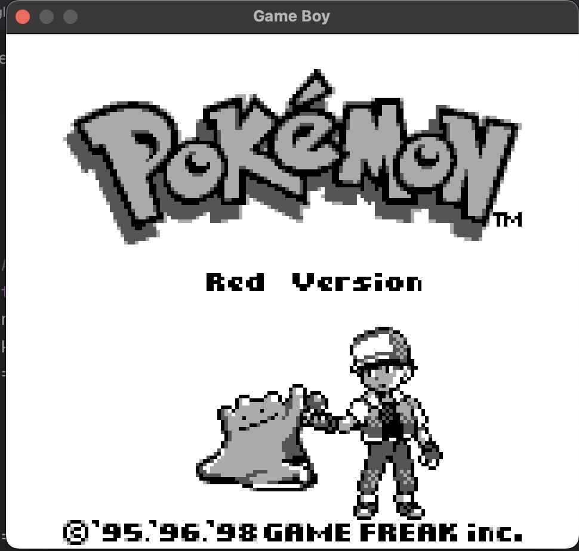

# Game Boy Emulator (LR35902)

Boots Pokemon Red/Blue.

> ### 🖥️ [First emulator working]
<p align="center">
  
</p>


Cycle-accurate Game Boy emulator targeting the Sharp LR35902 CPU, written in Rust. Built as the **second validation target** of a portable test framework — after CHIP-8 (C++) validated the adapter interface, this project stress-tests it at real scale: 500+ tests, property-based invariant checking, golden-file PPU validation, and Pokemon Red booting to the title screen as the end-to-end acceptance test.

---

## Why Game Boy as a validation target

- **Cycle-accurate timing** — every opcode has a defined cycle count. Timing errors cause audio/video desync — the same class of fault as hardware clock jitter
- **V-blank jitter analysis** — V-blank fires every 70224 cycles. Measuring interval variance across 1000 frames is the same analysis applied to oscilloscope waveform captures
- **Property-based testing** — invariants like "PC must always be within ROM address range" tested with proptest across thousands of randomly generated inputs
- **Golden-file PPU validation** — known-good framebuffer output captured as PNG, pixel-by-pixel regression on every CI run

---

## Technical details

| Property | Value |
|---|---|
| CPU | Sharp LR35902 (Z80-like, 8-bit) |
| Clock | 4.194304 MHz |
| RAM | 8KB WRAM + 8KB VRAM |
| ROM banking | MBC1 |
| Display | 160×144, 4-shade greyscale |
| V-blank | Every 70224 cycles (59.7 Hz) |

---

## Build

```bash
git clone https://github.com/itsVinM/gameboy_emulator.git
cd gameboy_emulator
cargo build --release
cargo run --release -- <PATH_TO_ROM>
```

**Headless (CI):**
```bash
cargo run --release -- --headless --frames 100 <PATH_TO_ROM>
```

---

## Tests

```bash
cargo test
cargo test --test integration
```

| Suite | What it covers |
|---|---|
| CPU opcodes | All LR35902 instructions, flags, half-carry edge cases |
| Timer | DIV increment, TIMA overflow, interrupt firing cycle |
| PPU | Scanline timing, OAM search, sprite priority |
| Interrupts | V-blank latency, IE/IF flag behavior |
| Integration | Tetris title screen, Pokemon Red boot |
| Property-based | PC range, register bounds, stack depth invariants |
| Golden files | PPU framebuffer pixel-by-pixel regression |

---

## Acceptance tests

| ROM | Test | Status |
|---|---|---|
| cpu_instrs.gb (Blargg) | All CPU instructions | ✅ |
| instr_timing.gb (Blargg) | Cycle-accurate timing | ✅ |
| Tetris | Title screen renders | ✅ |
| Pokemon Red | Boots to title screen | ✅ |

---

## V-blank jitter

V-blank interval measured across 1000 frames — same methodology as hardware clock jitter analysis:

```
mean:   16.742 ms  (spec: 16.742 ms)
stddev: ~0.003 ms
P99:    < 16.755 ms
```

---

## Framework context

| Target | Language | Status |
|---|---|---|
| CHIP-8 | C++17 + Google Test | ✅ Complete |
| Game Boy LR35902 | Rust + proptest | ✅ Complete |
| STM32F401RE | Rust embedded + CLI | 🔄 In progress |
| Digital Analyzer | Rust + SCPI | 🔄 In progress |
| PX4 SITL | Python + MAVLink | 📋 Planned |