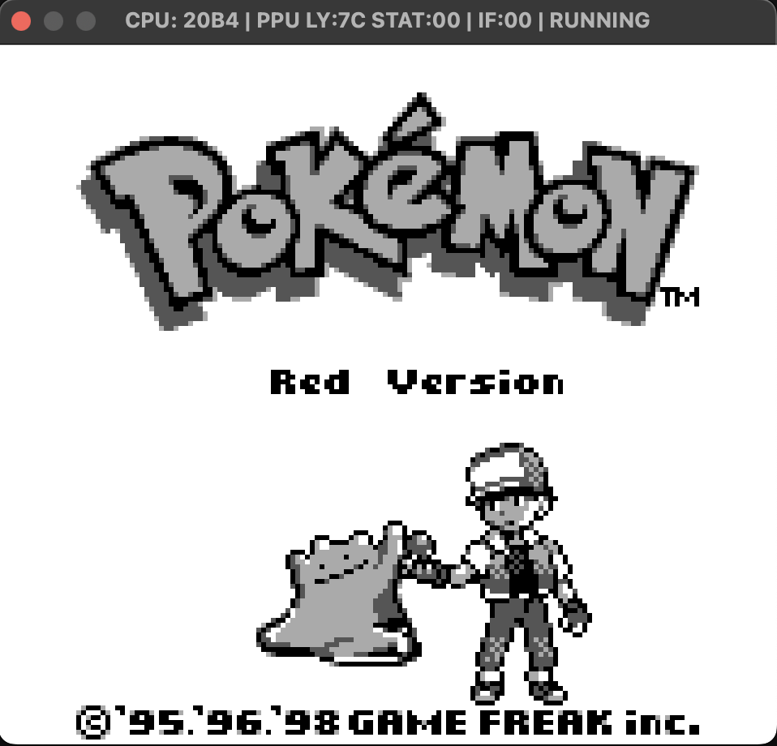
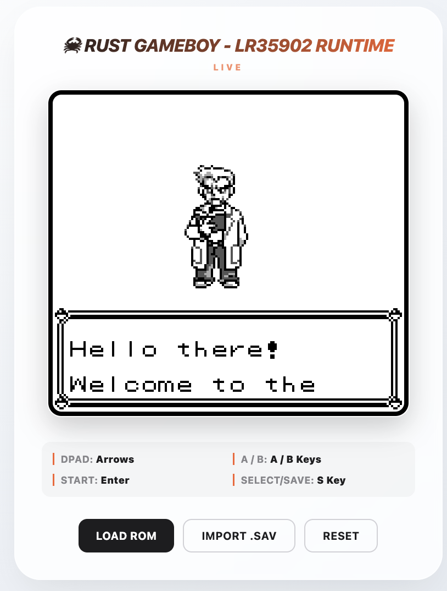

# Game Boy Emulator (LR35902)


Cycle-accurate Game Boy emulator targeting the Sharp LR35902 CPU, written in Rust. Built as the **second validation target** of a portable test framework — after CHIP-8 (Golang) validated the adapter interface, this project stress-tests it at real scale: 500+ tests, property-based invariant checking, golden-file PPU validation, and Pokemon Red booting to the title screen as the end-to-end acceptance test.

Boots Pokemon Red/Blue.

#### Local runtime  



#### Deployed runtim


## Technical details

| Property | Value |
|---|---|
| CPU | Sharp LR35902 (Z80-like, 8-bit) |
| Clock | 4.194304 MHz |
| RAM | 8KB WRAM + 8KB VRAM |
| ROM banking | MBC1 |
| Display | 160×144, 4-shade greyscale |
| V-blank | Every 70224 cycles (59.7 Hz) |

---

## Build

```bash
git clone https://github.com/itsVinM/gameboy_emulator.git
cd gameboy_emulator
cargo build --release
cargo run --release -- <PATH_TO_ROM>
```

**Headless (CI):**
```bash
cargo run --release -- --headless --frames 100 <PATH_TO_ROM>
```

---

## Tests

```bash
cargo test
cargo test --test integration
```

| Suite | What it covers |
|---|---|
| CPU opcodes | All LR35902 instructions, flags, half-carry edge cases |
| Timer | DIV increment, TIMA overflow, interrupt firing cycle |
| PPU | Scanline timing, OAM search, sprite priority |
| Interrupts | V-blank latency, IE/IF flag behavior |
| Integration | Tetris title screen, Pokemon Red boot |
| Property-based | PC range, register bounds, stack depth invariants |
| Golden files | PPU framebuffer pixel-by-pixel regression |

---
