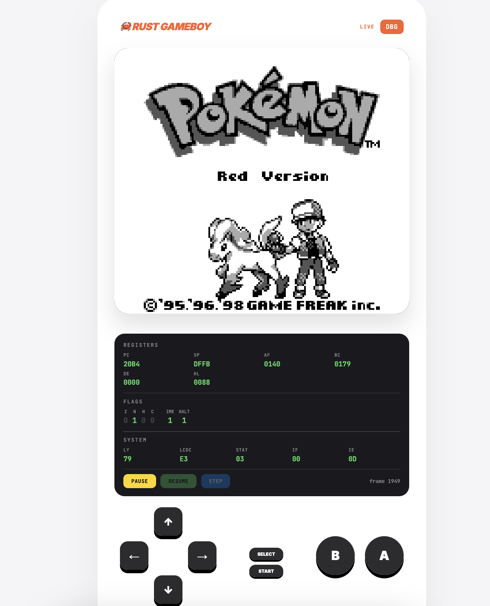

# PokéGB — Game Boy Emulator in Rust


Game Boy (DMG) emulator written in Rust, compiled to WebAssembly and playable in the browser. Boots and plays Pokémon Red/Blue through the title screen and into gameplay.

[**Play it live →**](https://itsvinm.github.io/gameboy_emu_poke/)

<br>
 

---

## Architecture

| Component | File | Details |
|---|---|---|
| CPU | `src/cpu.rs` | Full LR35902 instruction set, interrupts, HALT |
| MMU | `src/mmu.rs` | Memory map, MBC3 ROM/RAM banking, DMA |
| PPU | `src/ppu.rs` | Scanline renderer, BG/window/sprites, STAT interrupts |
| Registers | `src/registers.rs` | 8/16-bit register pairs, flag helpers |
| WASM bridge | `src/lib.rs` | `wasm-bindgen` bindings for the browser runtime |

## Hardware specs

| | |
|---|---|
| CPU | Sharp LR35902 (Z80-like, 8-bit) |
| Clock | 4.194304 MHz |
| RAM | 8 KB WRAM + 8 KB VRAM |
| ROM banking | MBC3 |
| Display | 160×144, 4-shade greyscale |
| Frame timing | 70224 cycles @ ~59.7 Hz |

---

## Build

Requires [wasm-pack](https://rustwasm.github.io/wasm-pack/).

```bash
wasm-pack build --target web
```

Then serve the project root over HTTP:

```bash
python3 -m http.server 8080
# open http://localhost:8080
```

Browsers block WASM loaded from `file://`, so a local server is required.

---

## Playing

The ROM is not included (copyright). Load any `.gb` file with the **LOAD ROM** button.

- **Keyboard**: Arrow keys = D-pad, `A` = A, `B` = B, `Enter` = Start, `S` = Select
- **Mobile**: on-screen buttons
- **Save**: progress auto-saves to `localStorage` every 5 seconds. Use **EXPORT .SAV** / **IMPORT .SAV** to move saves between devices.

---

## Tests

```bash
cargo test
cargo test --test integration
```

| Suite | Coverage |
|---|---|
| CPU opcodes | All LR35902 instructions, flags, half-carry edge cases |
| Timer | DIV increment, TIMA overflow, interrupt firing |
| PPU | Scanline timing, OAM search, sprite priority |
| Interrupts | V-blank latency, IE/IF flag behaviour |
| Integration | Pokémon Red boot sequence |
| Property-based | PC range, register bounds, stack depth invariants |
| Golden files | PPU framebuffer pixel regression |
