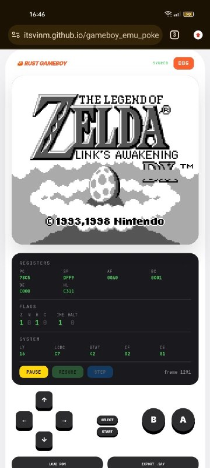
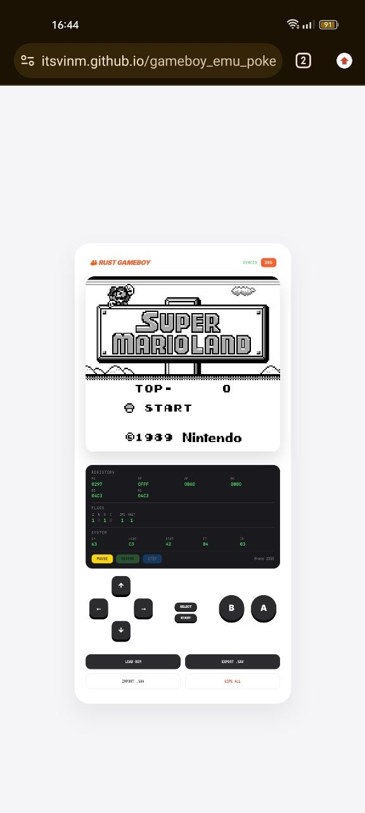

# PokéGB — Game Boy Emulator in Rust


Game Boy (DMG) emulator written in Rust, compiled to WebAssembly. Compatible with most MBC3 cartridges — tested with Pokémon Red/Blue, The Legend of Zelda, and Super Mario Land.

[**Play it live →**](https://itsvinm.github.io/gameboy_emu_poke/)

<p align="center">
  
  &nbsp;
  
  &nbsp;
  
</p>

---

## Stack

| | |
|---|---|
| CPU | Sharp LR35902 — full instruction set, interrupts, HALT |
| MMU | MBC3 ROM/RAM banking, DMA |
| PPU | Scanline renderer — BG, window, sprites, STAT interrupts |
| Runtime | `wasm-bindgen` → browser canvas |

## Build

**Browser (WASM)**
```bash
wasm-pack build --target web
python3 -m http.server 8080
# open http://localhost:8080
```

**Local native window**
```bash
cargo run -- rom.gb
```
Requires a `.gb` ROM file. `F5` saves, `Space` pauses, `N` steps when paused.

## Playing

Load any `.gb` file with **LOAD ROM** (ROM not included — copyright).

- **Keyboard**: arrows = D-pad · `A`/`B` · `Enter` = Start · `S` = Select
- **Save**: auto-saves to `localStorage` every 5s · **EXPORT / IMPORT .SAV** for transfer

## Tests

Covers CPU opcodes, timer, PPU scanlines, interrupts, and a Pokémon Red boot integration test.

```bash
cargo test && cargo test --test integration
```
